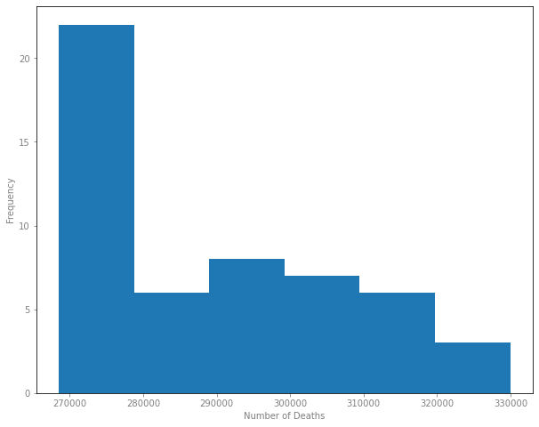

# Deaths and Select Causes Analysis

In this dataset I Used data from cdc website on deaths and causes each week. I analyzed the data to find useful information on the how the cause of deaths and number of deaths are realated.

The dataset used can be found <kbd><a href="https://data.cdc.gov/NCHS/Weekly-Counts-of-Death-by-Jurisdiction-and-Select-/u6jv-9ijr">here</a></kbd>

Tableau map for deaths per state can be found <kbd>[here](https://public.tableau.com/app/profile/luis5517/viz/Numberofdeathsperstate/Deaths_byStateDashboard)</kbd>

## Number of deaths for each cause

This graph showes the number of deaths in millions for each cause we can see that circulatory disease is the cause with the most deaths from 2015 to 2021.

## Number of deaths each year

In this graph we wanted to know how the amount of deaths changed each year, the year 2022 was excluded because it did not have the number of deaths for the full year. 
This line chart showes the change fromn 2015 to 2021.

There was a big jump from 2019 to 2020 but in 2021 the number of deaths went back down.

## Number of deaths each week frequency

In this histogram we wanted to know how if there was any diffrences in the number of deaths each week. 

We can see that there are more than 20 weeks that have between 270,000 and 280,000 number of deaths.

