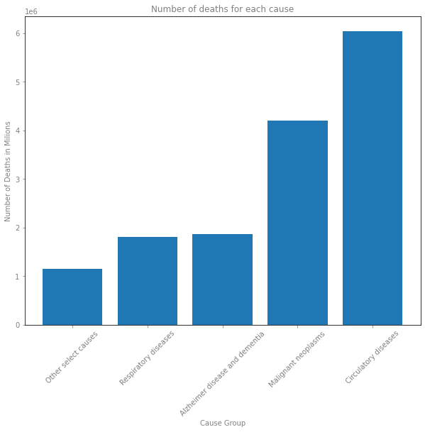
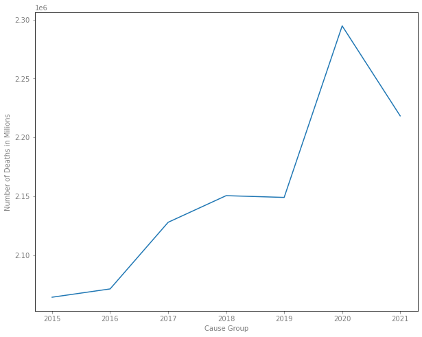

# Deaths and Select Causes Analysis

In this dataset I Used data from cdc website on deaths and causes each week. I analyzed the data to find useful information on the how the cause of deaths and number of deaths are realated.

The dataset used can be found <a href="https://data.cdc.gov/NCHS/Weekly-Counts-of-Death-by-Jurisdiction-and-Select-/u6jv-9ijr">here</a>

Tableau map for deaths per state can be found [here](https://public.tableau.com/app/profile/luis5517/viz/Numberofdeathsperstate/Deaths_byStateDashboard)

## Number of deaths for each cause

This graph showes the number of deaths in millions for each cause we can see that circulatory disease is the cause with the most deaths from 2015 to 2021 

## Number of deaths each year

## 

